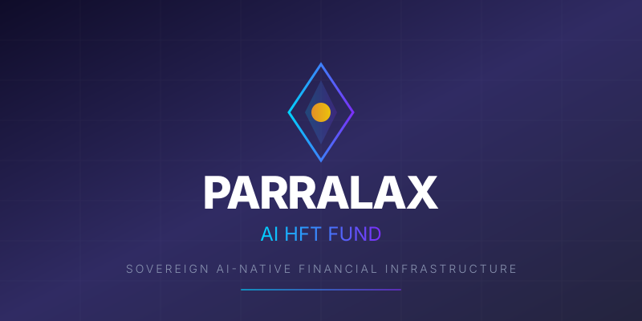
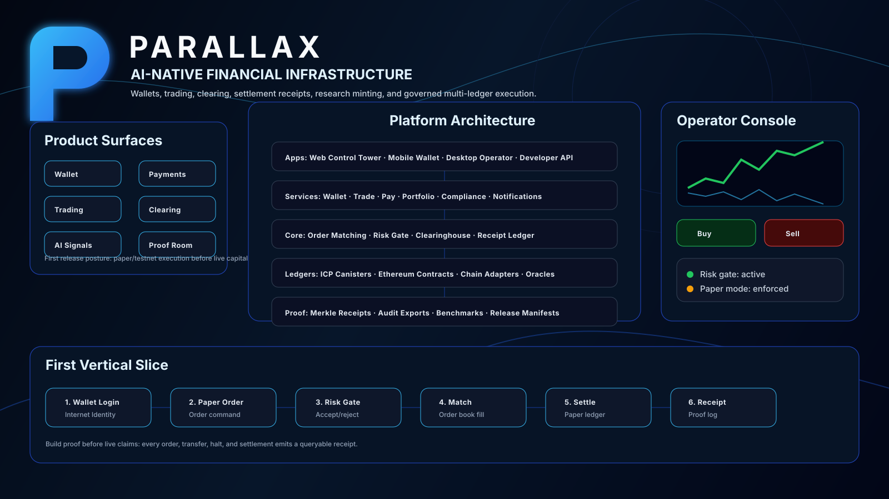
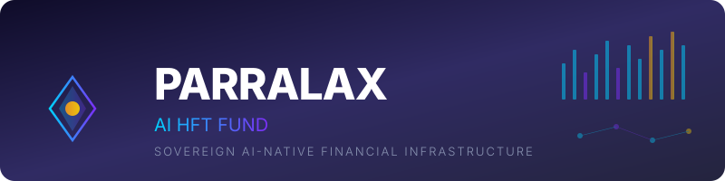

<p align="center">
  
</p>

<p align="center">
  <strong>Sovereign AI-Native Financial Execution Infrastructure</strong>
</p>

<p align="center">
  <a href="https://github.com/ItsNotAILABS/PARRALAX-AIHFTFUND/actions/workflows/ci.yml"></a>
  <a href="https://github.com/ItsNotAILABS/PARRALAX-AIHFTFUND/actions/workflows/python-publish.yml"></a>
  <a href="https://github.com/ItsNotAILABS/PARRALAX-AIHFTFUND/blob/main/LICENSE"></a>
  <a href="https://github.com/ItsNotAILABS/PARRALAX-AIHFTFUND"></a>
</p>

<p align="center">
  
  
  
  
  
  
  
  
  
</p>

<p align="center">
  
  
  
  
</p>

---

## 🏛️ What is PARRALAX?

**PARRALAX-AIHFTFUND** is a complete, sovereign financial operating system powered by artificial intelligence. It trades, manages risk, issues assets, governs operations, and executes across every major financial market — all autonomously, all under your control.

This isn't a library. It isn't a trading bot. It's a **full financial infrastructure** — the same kind of architecture that powers hedge funds, market makers, and institutional trading desks — made accessible to anyone.

> **Think of it as:** Your own AI-powered hedge fund infrastructure. One install. Full control. Every market.

---

## 🎯 Who Is This For?

| You are... | PARRALAX gives you... |
|---|---|
| **A trader** | AI agents that execute your strategies 24/7 across crypto, stocks, forex, and more |
| **A fund operator** | Complete fund infrastructure with governance, risk controls, and compliance rails |
| **A developer** | Production-grade APIs, SDKs, and a modular architecture to build on |
| **An investor** | Transparent, auditable execution with immutable compute receipts |
| **A builder** | A platform to launch your own financial products, tokens, and digital assets |

---

## ⚡ What Can It Do?

<table>
<tr>
<td width="50%">

### 📈 Trade Every Market
- Crypto (spot & futures)
- Equities & stocks
- Foreign exchange
- AI tokens & digital assets
- NFTs & programmable assets
- Internal fund tokens

</td>
<td width="50%">

### 🤖 AI Agents Work For You
- Signal detection agents
- Risk management agents
- Execution agents
- Governor agents (oversight)
- Portfolio optimization
- Multi-agent coordination

</td>
</tr>
<tr>
<td width="50%">

### 🛡️ Enterprise-Grade Security
- Multi-layer risk gates
- Kill switches (per-agent & system)
- Human approval gates
- Authority levels & permissions
- Compliance boundaries
- Immutable audit trail

</td>
<td width="50%">

### 🏦 Full Fund Operations
- Treasury management
- Asset issuance (tokens, NFTs)
- Governance protocols
- Performance attribution
- Regulatory compliance
- On-chain receipts

</td>
</tr>
</table>

---

## 🚀 Getting Started

### Option 1: One-Command Launch (Docker)

The fastest way to get the full platform running:

```bash
git clone https://github.com/ItsNotAILABS/PARRALAX-AIHFTFUND.git
cd PARRALAX-AIHFTFUND
docker-compose up -d
```

That's it. The entire platform — trading engine, AI agents, dashboard, API, database — all running.

**Open the Dashboard:** [http://localhost:3000](http://localhost:3000)  
**API Gateway:** [http://localhost:8000/docs](http://localhost:8000/docs)

---

### Option 2: Individual Services

<details>
<summary><strong>🦀 Rust HFT Execution Engine</strong> — Sub-millisecond order routing</summary>

```bash
cd rust/execution-engine
cargo build --release
cargo run
```

The execution engine handles order routing, risk gates, fill execution, and compute receipts at HFT speeds.

</details>

<details>
<summary><strong>🐍 Python Trading Infrastructure</strong> — AI agents & strategies</summary>

```bash
cd python
pip install -e ".[dev]"
python -m parralax
```

Includes signal agents, risk agents, execution orchestrators, market data adapters, paper trading, and strategy engines.

</details>

<details>
<summary><strong>⚛️ React Dashboard</strong> — Fund operations UI</summary>

```bash
cd src/frontend
pnpm install
pnpm dev
```

Real-time monitoring, agent control, portfolio views, and fund operations — all in one interface.

</details>

<details>
<summary><strong>🔧 CLI Tool</strong> — Command-line operations</summary>

```bash
cd services/cli
go build -o parralax ./...
./parralax --help
```

Manage agents, view positions, trigger actions, and monitor the system from your terminal.

</details>

<details>
<summary><strong>🧠 AI Service</strong> — Intelligence layer (FastAPI)</summary>

```bash
cd services/ai-service
pip install -e ".[dev]"
uvicorn app.main:app --reload
```

Full actuary suite, trading strategies, financial language engines (FIX, FpML, SWIFT, ISDA CDM, XBRL, ISO 20022).

</details>

---
<div align="center">

<picture>
  <source media="(prefers-color-scheme: dark)" srcset="assets/parallax-logo.svg">
  <source media="(prefers-color-scheme: light)" srcset="assets/parallax-logo-dark.svg">
  
</picture>

<br />

[](https://github.com/ItsNotAILABS/PARALLAX-Exchange-Clearinghouse/actions/workflows/ci.yml)
[](https://internetcomputer.org/)
[](contracts/)
[](https://react.dev/)
[](https://www.typescriptlang.org/)
[](docs/CLOUDFLARE_EDGE_RUNWAY.md)
[](docs/NATIVE_CPP_INTERFACE.md)
[](docs/ALPHA_SERVICE_RUNWAY.md)
[](docs/AI_WALLET_ALPHA.md)
[](research/)

# PARALLAX

### AI-native financial infrastructure for multi-ledger agents, token economics, trading, clearing, settlement receipts, and governed edge execution.

[Platform Blueprint](docs/PARALLAX_PLATFORM_SURFACE.md) · [Cloudflare Edge](docs/CLOUDFLARE_EDGE_RUNWAY.md) · [Multi-Ledger Ecosystem](docs/MULTI_LEDGER_ECOSYSTEM.md) · [Agent Token Economics](docs/AGENT_TOKEN_ECONOMICS.md) · [Showcase Gate](docs/PRODUCT_SHOWCASE_GATE.md) · [Native C/C++ Interface](docs/NATIVE_CPP_INTERFACE.md)

</div>

---

<div align="center">
  
</div>

## 🚀 What is PARALLAX?

**PARALLAX** is a next-generation **AI-native decentralized exchange** built on the Internet Computer Protocol (ICP). Unlike traditional DEXs, PARALLAX operates as a **sovereign organism** — an autonomous system where intelligence IS the infrastructure.

```
┌────────────────────────────────────────────────────────────────────┐
│                    THE PHANTOM EXCHANGE                            │
│                                                                    │
│   🧠 AI Intelligence Layer → Reasons about every trade            │
│   ⚡ Zero Gas Fees        → Organism pays all costs               │
│   🔄 873ms Settlement     → Heartbeat-driven finality             │
│   🌐 Universal Trading    → Crypto, AI Tokens, Artifacts, RWAs    │
│   🔒 Central Counterparty → Organism-guaranteed settlements       │
│                                                                    │
└────────────────────────────────────────────────────────────────────┘
```

## ✨ Key Features

### 🎯 **Zero Gas Fees — Forever**
The organism runs on ICP canisters. Canister cycles are paid by the organism's own treasury. Users **never** pay gas. Ever.

### ⚡ **873ms Instant Settlement**
Settlement is not a separate step — it IS the heartbeat. Every **873ms** all trades settle with cryptographic finality. *(Derived from φ⁴ × 1000ms / 7.83Hz Schumann resonance)*

### 🧠 **AI-First Architecture**
Every trade is a cognitive act. The **Phantom Intelligence Engine** reasons about markets continuously:
- Detects arbitrage opportunities across all pairs
- Values AI artifacts using cognitive resonance scoring  
- Predicts price movements using harmonic wave analysis
- Gates operations through Kuramoto coherence (R ≥ 0.618)

### 🏦 **Real-Time Clearinghouse**
Multi-asset netting, cross-chain settlement (ICP ↔ ckBTC ↔ ckETH), organism-guaranteed trades:
- Bilateral and multilateral netting every beat
- Central counterparty guarantee — no counterparty risk
- FinCEN-compatible transaction reporting

### 🪙 **Universal Token Trading**
Trade everything in existence:
| Category | Examples |
|----------|----------|
| **Crypto** | BTC, ETH, ICP, SOL |
| **AI Compute Tokens** | GPU, TPU, Memory, Bandwidth, Storage |
| **AI Inference Tokens** | Inference, RAG, Embedding, Reasoning Chain |
| **AI Training Tokens** | Training, Fine-Tune, LoRA, Data |
| **AI Agent Tokens** | Agent Execution, Orchestration, Workflows |
| **AI Capability Tokens** | Vision, Audio, Code Gen, Translation, Prediction |
| **AI Governance Tokens** | Model Votes, Dataset Votes, Safety Audits, Certifications |
| **AI Artifacts** | Models, Agents, RAG Pipelines, Embeddings, Knowledge Graphs |
| **Creator Tokens** | Personal tokens, Fan tokens |
| **Stablecoins** | USDC, USDT (bridged) |
| **Real World Assets** | Commodities, Real Estate |

### 🤖 **AI Artifact Marketplace**
Trade tokenized AI intellectual property:
| Artifact Type | Description |
|---------------|-------------|
| **Foundation Models** | Large language models, vision models, multimodal |
| **Fine-tuned Models** | Domain-specific adaptations, LoRA weights |
| **Autonomous Agents** | Full agents with tools, memory, and workflows |
| **RAG Systems** | Pipelines, vector databases, knowledge bases |
| **Generative Models** | Image, video, audio, code, 3D generation |
| **Training Datasets** | Curated, synthetic, preference, instruction data |
| **Safety & Alignment** | Guardrails, filters, evaluation suites |

### 🏭 **24 Production Engines**
Sovereign financial-economic production engines with Latin names, running 93+ AI model ensembles:
- **Oeconomia.Machina Pretium** — Dynamic pricing engine
- **Arbitrium.Nexus** — Cross-market arbitrage detection
- **Portio.Optima** — Phi-weighted Markowitz allocation
- And 21 more specialized engines...

## 🏗️ Architecture

```
┌─────────────────────────────────────────────────────────────────────┐
│                         USER INTERFACES                              │
│  ┌────────────┐  ┌────────────┐  ┌────────────┐  ┌──────────────┐ │
│  │  Dashboard  │  │    CLI     │  │    API     │  │  VS Code Ext │ │
│  └────────────┘  └────────────┘  └────────────┘  └──────────────┘ │
├─────────────────────────────────────────────────────────────────────┤
│                         API GATEWAY (FastAPI)                        │
├──────────────┬──────────────┬──────────────┬────────────────────────┤
│  AI AGENTS   │  EXECUTION   │  ON-CHAIN    │  FUND OPERATIONS       │
│  ──────────  │  ENGINE      │  LAYER       │  ──────────────        │
│  Signal      │  ──────────  │  ──────────  │  Treasury              │
│  Risk        │  Order Router│  ICP Canistr │  Governance            │
│  Execution   │  Risk Gates  │  ERC-20/721  │  Compliance            │
│  Governor    │  Fill Engine │  Receipts    │  Asset Issuance        │
│  Portfolio   │  Receipts    │  DeFi Bridge │  Performance           │
├──────────────┴──────────────┴──────────────┴────────────────────────┤
│  PERSISTENCE    │  MESSAGING      │  COMPUTE          │  INFRA      │
│  PostgreSQL     │  Redis/Celery   │  ALOHA I Protocol │  Docker/K8s │
│  S3 Archive     │  WebSocket      │  Phantom Engines  │  CI/CD      │
└─────────────────┴─────────────────┴───────────────────┴─────────────┘
```

---

## 📊 Technology Stack

| Layer | Technology | What It Does |
|-------|-----------|--------------|
| **Execution Core** | Rust | Sub-millisecond order routing, risk gates, HFT engine |
| **Trading Intelligence** | Python | AI agents, signals, strategies, market data, backtesting |
| **Web Dashboard** | React + TypeScript | Real-time fund operations UI |
| **Backend Services** | Go + Rails + FastAPI | Git operations, REST APIs, business logic |
| **On-Chain** | Motoko (ICP) + Solidity | Smart contracts, token factory, on-chain state |
| **Data** | PostgreSQL + Redis | Ledger, positions, cache, message queue |
| **Infrastructure** | Docker + Kubernetes | Multi-service orchestration, auto-scaling |
| **Financial Protocols** | FIX, FpML, SWIFT, XBRL | Industry-standard financial messaging |

---

## 🧠 AI & Intelligence Systems

PARRALAX includes multiple AI subsystems that work together:

- **ALOHA I** — Autonomous Liquid Orchestration & Harmonic Arbitrage Intelligence (10 protocol models)
- **Phantom Engines** — 30+ specialized trading intelligence modules (volatility, sentiment, neural, fractal, microstructure, etc.)
- **Signal Fusion** — Multi-model signal aggregation with confidence scoring
- **Cognitive Market Making** — Adaptive spread and inventory management
- **Neural Portfolio** — AI-driven portfolio construction and rebalancing
- **Entropic Risk** — Information-theoretic risk measurement
- **Swarm Execution** — Distributed execution across venues

---

## 🔐 Security & Governance

Every action in PARRALAX is governed, audited, and controlled:

| Control | Description |
|---------|-------------|
| **Risk Gates** | Multi-layer checks before any trade executes |
| **Kill Switches** | Instant halt — per-agent or system-wide |
| **Authority Levels** | Observer → Proposer → Executor → Governor progression |
| **Compute Receipts** | Immutable proof of every operation |
| **Compliance Boundary** | Regulatory guardrails built into the protocol |
| **Human Override** | You always retain ultimate authority |

📄 See [SECURITY.md](./SECURITY.md) · [GOVERNANCE.md](./GOVERNANCE.md) · [RISK.md](./RISK.md) · [COMPLIANCE_BOUNDARY.md](./COMPLIANCE_BOUNDARY.md)

---

## 📂 Repository Structure

```
PARRALAX-AIHFTFUND/
├── rust/execution-engine/     # 🦀 HFT execution engine (Rust)
├── python/parralax/           # 🐍 Trading AI & strategy engines
├── src/
│   ├── frontend/              # ⚛️  React dashboard
│   └── backend/               # 🧠 On-chain canisters (Motoko/ICP)
├── services/
│   ├── ai-service/            # 🤖 AI intelligence layer (FastAPI)
│   ├── rails-api/             # 💎 Business logic API (Rails)
│   ├── rust-engine/           # ⚙️  Core computation engine
│   ├── git-service/           # 📦 Git operations (Go)
│   ├── cli/                   # 🔧 Command-line interface (Go)
│   └── vscode-extension/      # 🖥️  VS Code integration
├── k8s/                       # ☸️  Kubernetes manifests
├── monitoring/                # 📊 Observability configs
├── docs/                      # 📚 Documentation
├── CHARTER.md                 # 🏛️  Fund charter
├── GOVERNANCE.md              # ⚖️  Governance framework
├── RISK.md                    # 🛡️  Risk management
├── ROADMAP.md                 # 🗺️  Development roadmap
└── docker-compose.yml         # 🐳 One-command full stack
```

---

## 📋 Protocol & Charter Documents

PARRALAX operates under a comprehensive set of governance documents:

| Document | Purpose |
|----------|---------|
| [CHARTER.md](./CHARTER.md) | Core fund charter and mission |
| [GOVERNANCE.md](./GOVERNANCE.md) | Decision-making framework |
| [RISK.md](./RISK.md) | Risk management protocols |
| [EXECUTION_PROTOCOL.md](./EXECUTION_PROTOCOL.md) | Order execution rules |
| [TOKEN_PROTOCOL.md](./TOKEN_PROTOCOL.md) | Internal token system |
| [NFT_PROTOCOL.md](./NFT_PROTOCOL.md) | Digital asset NFTs |
| [TREASURY_PROTOCOL.md](./TREASURY_PROTOCOL.md) | Treasury operations |
| [COMPUTE_RECEIPT_PROTOCOL.md](./COMPUTE_RECEIPT_PROTOCOL.md) | Proof-of-execution |
| [AGENT_AUTHORITY_CHARTER.md](./AGENT_AUTHORITY_CHARTER.md) | Agent permissions |
| [ASSET_ISSUANCE_CHARTER.md](./ASSET_ISSUANCE_CHARTER.md) | Asset creation rules |
| [COMPLIANCE_BOUNDARY.md](./COMPLIANCE_BOUNDARY.md) | Regulatory boundaries |

---

## 🗺️ Roadmap

| Phase | Status | Focus |
|-------|--------|-------|
| **Phase 1** — Foundation | ✅ Complete | Core architecture, protocols, charters |
| **Phase 2** — Simulation | 🔄 In Progress | Paper trading, backtesting, signal agents |
| **Phase 3** — Digital Assets | 📋 Planned | Token models, NFTs, asset registry |
| **Phase 4** — Broker Integration | 📋 Planned | Alpaca, Binance, IB, DEX adapters |
| **Phase 5** — Agent Authority | 📋 Planned | Progressive autonomy, learning, kill switches |
| **Phase 6** — Fund Operations | 📋 Planned | Full dashboard, treasury, compliance |
| **Phase 7** — Autonomous Ops | 📋 Planned | Multi-agent coordination, cross-market |

📄 Full details: [ROADMAP.md](./ROADMAP.md)

---

## 🧪 Development

### Prerequisites

- **Docker** (recommended) — for one-command setup
- **Rust** 1.75+ — for the execution engine
- **Python** 3.11+ — for trading infrastructure
- **Node.js** 16+ & pnpm — for the dashboard
- **Go** 1.22+ — for services and CLI

### Running Tests

```bash
# Rust execution engine
cd rust/execution-engine && cargo test --all-features

# Python trading AI
cd python && pip install -e ".[dev]" && pytest tests/ -v

# AI service
cd services/ai-service && pip install -e ".[dev]" && pytest tests/ -v

# Go services
cd services/git-service && go test ./... -v -race
cd services/cli && go test ./... -v

# Full CI (runs everything)
# Triggered automatically on push to main/develop
```

### CI/CD Pipeline

The repository runs a comprehensive CI/CD pipeline on every push:

- ✅ Rust engine — build, test, clippy
- ✅ Rust HFT engine — build, test
- ✅ Go git service — build, test, vet
- ✅ Go CLI — build, test
- ✅ Python AI service — lint, typecheck, test, integration
- ✅ Python trading — lint, test, strategy verification
- ✅ Rails API — setup, test
- ✅ Integration tests — cross-service validation
- ✅ Docker build — all services containerized
- ✅ Kubernetes deploy — production orchestration

---

## 🤝 Contributing

We welcome contributions. Please review:

1. [GOVERNANCE.md](./GOVERNANCE.md) — How decisions are made
2. [SECURITY.md](./SECURITY.md) — Security policies
3. [AGENTS.md](./AGENTS.md) — Agent development guidelines

---

## 📄 License

[MIT License](./LICENSE) — Copyright © 2026

---

<p align="center">
  
</p>

<p align="center">
  <strong>Built for sovereignty. Engineered for execution. Powered by intelligence.</strong>
</p>

<p align="center">
  <sub>PARRALAX-AIHFTFUND — Sovereign AI-Native Financial Infrastructure</sub>
</p>

---

## 🌌 PARALLAX Exchange Clearinghouse

**The AI-First Sovereign Exchange — Zero Gas Fees, Instant Settlement**

The PARALLAX Exchange Clearinghouse is the on-chain execution layer of the platform, built on the Internet Computer Protocol (ICP). It operates as a sovereign organism — an autonomous system where intelligence IS the infrastructure.

| Feature | Detail |
|---------|--------|
| **Zero Gas Fees** | Organism pays all canister cycle costs — users never pay gas |
| **873ms Settlement** | Heartbeat-driven finality derived from φ⁴ × 1000ms / 7.83Hz |
| **AI-First** | Phantom Intelligence Engine reasons about every trade |
| **Clearinghouse** | Central counterparty guarantee, bilateral/multilateral netting |
| **Universal Trading** | Crypto, AI tokens, artifacts, RWAs, creator tokens, stablecoins |

### On-Chain Architecture

```
                           ┌─────────────────────┐
                           │    PARALLAX Core    │
                           │     (main.mo)       │
                           └──────────┬──────────┘
                                      │
           ┌──────────────────────────┼──────────────────────────┐
           │                          │                          │
           ▼                          ▼                          ▼
  ┌─────────────────┐      ┌─────────────────┐      ┌─────────────────┐
  │    Phantom      │      │    Phantom      │      │    Phantom      │
  │  Intelligence   │ ───▶ │    Exchange     │ ───▶ │  Clearinghouse  │
  │   (reasons)     │      │   (executes)    │      │   (settles)     │
  └─────────────────┘      └─────────────────┘      └─────────────────┘
           │                          │                          │
           └──────────────────────────┼──────────────────────────┘
                                      │
           ┌──────────────────────────┼──────────────────────────┐
           │                          │                          │
           ▼                          ▼                          ▼
  ┌─────────────────┐      ┌─────────────────┐      ┌─────────────────┐
  │  Token Factory  │      │  AI Artifact    │      │   Production    │
  │  (mints tokens) │      │   Registry      │      │    Engines      │
  └─────────────────┘      └─────────────────┘      └─────────────────┘
```

### Core Modules

| Module | Purpose |
|--------|---------|
| `phantom_intelligence.mo` | AI reasoning layer — decides WHAT to trade and WHY |
| `phantom_exchange.mo` | Order book, matching engine — executes trades |
| `phantom_clearinghouse.mo` | Settlement, netting, guarantees |
| `token_factory.mo` | Mint 37 AI token types (Compute, GPU, Agent, RAG, etc.) |
| `ai_artifact_registry.mo` | Register & trade 55 artifact types (Models, Agents, RAG, etc.) |
| `production_engines.mo` | 24 Latin-named AI production engines |
| `phi.mo` | Golden ratio constants & Fibonacci sequences |
| `sovereign_db.mo` | Orthogonal persistence — single source of truth |

### AI Token Types (37 Types, 31 Genesis Instances)

| Category | Token Types |
|----------|-------------|
| **Core Infrastructure** | AICPU, AIMEM, AIINF, AITRAIN, AIDATA |
| **Advanced Resources** | AIGPU, AITPU, AIBW, AIST, AIFT, AIEMB, AIRAG, AIAGENT, AIORCH, AICHAIN |
| **Specialized Capabilities** | AIVIS, AIAUD, AICODE, AITRANS, AISENT, AIANOM, AIPRED, AIOPT, AISIM |
| **Governance & Quality** | AIMVOTE, AIDVOTE, AISAFE, AIRED, AIBENCH, AICERT |
| **Standard Types** | creatorPersonal, artifactBacked, governance, yield, utility, rewardPoints, fractionalNFT |

### AI Artifact Types (55 Types, 30 Genesis Instances)

| Category | Artifact Types |
|----------|----------------|
| **Foundation** | Sovereign Models, Embeddings, Knowledge Graphs, Protocols, Predictions |
| **Advanced Models** | Foundation, Fine-tuned, LoRA, Merged, Quantized, Distilled, Multimodal, Specialist, Aligned |
| **Autonomous Agents** | Agents, Toolkits, Memory, Personas, Workflows, Orchestrators, Evaluators |
| **RAG & Knowledge** | RAG Pipelines, Vector DBs, Embedding Models, Rerankers, Chunkers, Knowledge Bases |
| **Prompts & Evaluation** | Templates, Libraries, Few-Shot Examples, Evaluation Suites, Test Harnesses, Red-Team Datasets |
| **Training & Data** | Synthetic, Labeled, Preference, Instruction, Code, Multilingual Datasets |
| **Generative** | Image, Video, Audio, Code, 3D, Motion, TTS, Voice Clone Models |
| **Safety** | Safety Filters, Alignment Protocols, Guardrails, Toxicity Classifiers, Bias Audits |

## 🔢 The PHI Foundation

All system parameters are derived from mathematical constants, not arbitrary choices:

```motoko
// φ — The Golden Ratio
public let PHI : Float = 1.6180339887498948482;

// Heartbeat: φ⁴ × (1000 / 7.83Hz) = 873ms
// Schumann resonance anchors the system to Earth's natural frequency

// Confidence gates at φ⁻¹ = 0.618
// Spread limits at PHI_INV_3
// Supply caps = Fibonacci[n] × φ^k
```

---

<p align="center">
  
</p>

<p align="center">
  <strong>Built for sovereignty. Engineered for execution. Powered by intelligence.</strong>
</p>

<p align="center">
  <sub>PARRALAX-AIHFTFUND — Sovereign AI-Native Financial Infrastructure — Built by <a href="https://github.com/ItsNotAILABS">ItsNotAILABS</a></sub>
</p>
